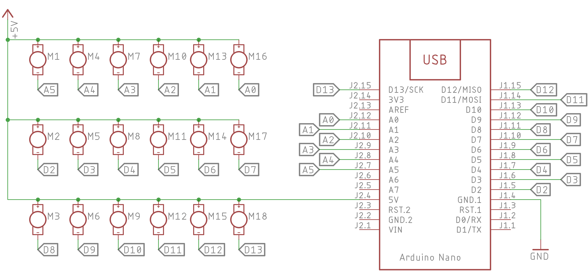

# Haptic Wrist Band

Collab: Elastic Spaces 
Fall 2020 
Parsons School of Design x UC Boulder 

Assignment: Protocol

----

##### Schematic for Haptic Wrist Band

---
### [Photo Gallery of Working Prototype](https://photos.app.goo.gl/42HRiYd7mWG8xJLg8)

---
## Source Files
* [Arduino Nano Code](./elastic_spaces_wrist_band/elastic_spaces_wrist_band.ino)
* [Telegram Bot, Emotion Analysis & MQTT Publisher](./protocol.py)
* [Connector - Arduino and MQTT Server](./connector.py)
* [Emotion Expression on Haptic Wrist Band](./haptic-emotions.pdf)

# Protocol for sending data
\*\<intensity>@\<frameDelay>$\<frames>#\<frameData>*

* **intensity** - Intensity on which you haptic motor vibrates. Value ranges from 1-254.
* **frameDelay** - Delay in *milliseconds* betwen two frames.
* **frames** - Number of frames you are sending as animation. *Maximum number of frames will be capped at **100 frames in single payload**.*
* **frameData** - Sequential frame data.

*Let us assume Mx represents a Haptic Motor at position x, then each frame would look like M0, M1, M2,...,M17 where Mx can assume a **binary value** of 0 or 1*

## Setting credentials in your local environment

~~~ python
# Run the following python commands
os.environ['telegram_bot_api_token'] = '<YOUR-TELEGRAM-BOT-TOKEN>'
os.environ['ParallelDots'] = '<YOUR-PARALLELDOTS-API-KEY>'
~~~

## Running the script
~~~
python3 protocol.py
~~~

In a new terminal window/tab, run the following command
~~~
python3 connector.py <ARDUINO NANO's COM PORT>

<!-- Say I am using COM4, the above command formulates to -->
python3 connector.py COM4
~~~
**TIP:** You can find the COM Port by using Arduino IDE

# Team
* [Akshay Baweja](https://akshaybaweja.com) - Parsons School of Design
* [Benny Zhang](https://www.behance.net/juniorbenny) - Parsons School of Design